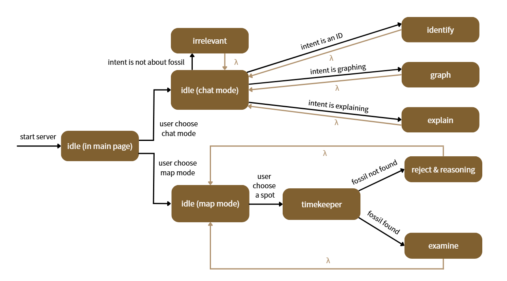

# 🦕 FossilMind - 化石鑑定與探索
> **TOC 2025 Final Project**

**FossilMind** 是一個結合大型語言模型 (LLM) 與視覺化工具的古生物 AI Agent。它不僅能透過自然語言鑑定化石，還能自動檢索維基百科圖片，並生成動態演化樹狀圖，旨在協助使用者探索地球的深層記憶。

##  Key Features

1.  **化石鑑定**
    - **Identify**：Agent 能解析使用者對化石外觀的模糊描述，推測學名與年代等更多訊息。
    - **Retrieval-Augmented Generation**：鑑定後自動透過 Wiki API 檢索並回傳真實化石照片，解決 LLM 無法提供真實影像的問題。
2.  **演化圖生成**
    - Agent 會根據鑑定結果生成 Graphviz DOT 腳本，並即時渲染出該物種的親緣演化樹。
3.  **挖掘地圖**
    - **Timekeeper**：驗證地質年代邏輯。
    - **Paleontologist**：根據挖掘結果撰寫科普鑑定報告。
  
## File Structure

| File | Description |
| :--- | :--- |
| `app.py` | **Controller**: Handles Flask routing, image assembly, and response logic |
| `backend.py` | **Model**: Encapsulates LLM logic, Prompt Engineering, and intent classification |
| `utils.py` | **Tools**: Handles Wiki API search, Regex keyword extraction, and tag cleaning |
| `database.py` | **Data**: Manages JSON conversation history read/write operations |
| `config.py` | **Config**: Stores API Keys and global configuration |
| `templates/` | Frontend HTML (Chat UI & Leaflet Map) |
| `static/` | Stores pictures |

---

## Installation Guide

### 1. Prerequisites

* **Python**: Version 3.9 or higher
* **Graphviz**: **Required system software** 

### 2. System Dependencies

#### A. Install Graphviz

* Windows: [Download installer](https://graphviz.org/download/)
* macOS: `brew install graphviz`
* Linux: `sudo apt-get install graphviz`

### 3. Project Setup
* Step 1: Clone the project
`git clone https://github.com/Narcisal/FossilMind.git`

* Step 2: Install Python packages
`pip install -r requirements.txt`

### 4. Run Server
Execute the following command to start the Flask server:
`python app.py`

You should see the following message indicating successful startup:

`FossilMind 伺服器啟動中... (http://127.0.0.1:5000)`

## Finite State Machine

