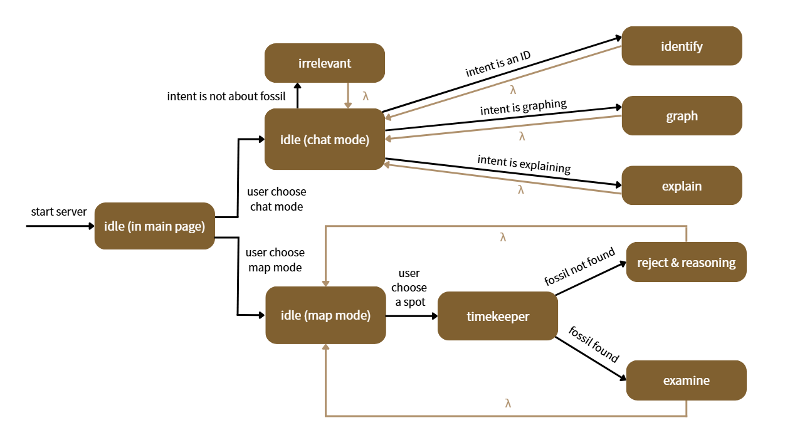

# FossilMind: Fossil Identification and Exploration

> Final project for Theory of Computation (TOC), 2025

**FossilMind** is a paleontology AI agent that combines a large language model (LLM) with visualization tools. It identifies fossils from natural-language descriptions, retrieves reference images from Wikipedia, and generates phylogenetic trees, helping users explore Earth's deep past.

For more details, see the [presentation slides](https://www.canva.com/design/DAG815-GKS0/w-lTjrgIW-A2A3j1WYGJOw/edit?utm_content=DAG815-GKS0&utm_campaign=designshare&utm_medium=link2&utm_source=sharebutton).

## Key Features

1. **Fossil Identification**
    - **Identify**: The agent interprets vague descriptions of a fossil's appearance and infers its scientific name, geological age, and other details.
    - **Retrieval-Augmented Generation**: After identification, the agent queries the Wikipedia API for a real photograph of the specimen, compensating for the LLM's inability to provide authentic images.
2. **Phylogenetic Tree Generation**
    - Based on the identification result, the agent writes a Graphviz DOT script and renders the species' phylogenetic tree on the fly.
3. **Excavation Map**
    - **Timekeeper**: Checks whether the selected location and geological era are geologically consistent.
    - **Paleontologist**: Writes an educational report based on the excavation result.

## File Structure

| File | Description |
| :--- | :--- |
| `app.py` | **Controller**: Handles Flask routing, image assembly, and response logic |
| `backend.py` | **Model**: Encapsulates LLM calls, prompt engineering, and intent classification |
| `utils.py` | **Tools**: Handles Wikipedia API search, regex keyword extraction, and tag cleanup |
| `database.py` | **Data**: Stores conversation history and generated phylogenetic trees in SQLite |
| `config.py` | **Config**: Reads the API key, model, and database settings from environment variables (`.env`) |
| `templates/` | Frontend HTML (chat UI and Leaflet map) |
| `static/` | Static images |
| `tests/` | Pytest suite; LLM calls are mocked, so running tests never consumes API credits |
| `.github/workflows/ci.yml` | GitHub Actions: import check and test suite on every push |
| `Dockerfile` | Container build (includes the system-level Graphviz dependency) |

---

## Installation Guide

### 1. Prerequisites

- **Python**: 3.9 or higher
- **Graphviz**: Required system software

### 2. System Dependencies

Install Graphviz:

- Windows: [Download the installer](https://graphviz.org/download/)
- macOS: `brew install graphviz`
- Linux: `sudo apt-get install graphviz`

### 3. Project Setup

Step 1: Clone the repository

```bash
git clone https://github.com/Narcisal/FossilMind.git
```

Step 2: Install the Python packages

```bash
pip install -r requirements.txt
```

Step 3 (optional): Create a `.env` file

```bash
cp .env.example .env
```

You can skip this step and configure the AI service in the browser instead (see step 5). If you set `FOSSILMIND_API_KEY` in `.env`, the server uses it directly and the setup dialog never appears. The key targets the NCKU course gateway by default; to use another service, set `FOSSILMIND_API_URL` and `FOSSILMIND_MODEL_NAME`, and set `FOSSILMIND_API_FORMAT` to `ollama` (NCKU gateway, local Ollama) or `openai` (any OpenAI-compatible chat completions endpoint). The application never falls back to a hardcoded key.

### 4. Run the Server

Start the Flask server:

```bash
python app.py
```

Once it has started, open http://127.0.0.1:5000 in your browser.

The server runs with `debug=False` by default. For local development with verbose error pages, set `FLASK_DEBUG=true` in `.env`. Never enable this in a deployed environment.

### 5. Configure the AI Service

If no key is set in `.env`, the home page shows a setup dialog the first time it is opened. Choose a service, paste your API key, and optionally override the model:

| Service | Default model |
| :--- | :--- |
| NCKU course API | `gpt-oss:20b` |
| OpenAI | `gpt-6-luna` |
| Google Gemini | `gemini-3.8-flash` |

The server sends one short test request before saving, so an invalid key or model is rejected immediately. The settings are saved to `llm_settings.json` on the server (ignored by Git and Docker) and apply to every page and every visitor; until they are saved, the chat and map pages redirect to the home page.

**The settings cannot be changed from the website.** To change them, rebuild and restart the project:

- Docker: rebuild the image and start a new container (`docker build` and `docker run` in step 7). The settings live inside the container, so a new container starts unconfigured.
- Running with `python app.py`: delete `llm_settings.json` and restart the server.

Service endpoints are fixed on the server, so the setup dialog cannot make it connect to arbitrary addresses. To offer more services, add entries to `PROVIDERS` in `config.py`.

For local development without an API key, set `FOSSILMIND_LOCAL_OLLAMA_URL` (for example `http://localhost:11434/api/chat`) to add a **本機 Ollama** (local Ollama) option to the dialog; Ollama accepts any key. Do not set it in a deployed environment.

### 6. Run the Tests

```bash
pip install -r requirements-dev.txt
python -m pytest tests/ -v
```

All LLM calls are mocked in the test suite, so no real API key or network access is required.

### 7. Run with Docker (alternative to steps 1–4)

```bash
docker build -t fossilmind .
docker run -p 5000:5000 --env-file .env fossilmind
```

The image bundles Graphviz, so nothing else needs to be installed on the host.

Conversation history is stored in a SQLite database inside the container and is lost when the container is removed. To keep it, mount a volume and point `FOSSILMIND_DB_FILE` at it:

```bash
docker run -p 5000:5000 --env-file .env -v fossilmind-data:/data -e FOSSILMIND_DB_FILE=/data/chats.db fossilmind
```

When upgrading from an older version that stored history in `chats.json`, the file is imported automatically the first time the application starts with an empty database.

## Finite State Machine


